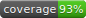
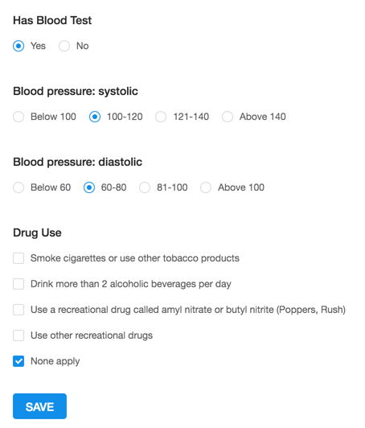

[](https://www.bithound.io/bitbucket/arabellatech/survey-form)
[](https://www.bithound.io/bitbucket/arabellatech/survey-form/develop/dependencies/npm)
[](https://www.bithound.io/bitbucket/arabellatech/survey-form/develop/dependencies/npm)
[](https://www.bithound.io/bitbucket/arabellatech/survey-form)

# survey-form

survey-form module is a module with **SurveyForm** container which render survey form based on schema fetched from API based on `surveyId` property.



## Install survey-form in your-project
1. Run `yarn add https://bitbucket.org/arabellatech/survey-form`
2. Add to your project reducers and sagas from **redux-connect-backend** module. [Click here](https://bitbucket.org/arabellatech/redux-connect-backend) for further information

## Usage

Usage of the survey form is very easy. You need to import **SurveyForm** component and pass to it `surveyId` property.

```javascript
import SurveyForm from 'survey-form';

<SurveyForm surveyId={105} />
```

## Actions

You can import and watch following action types in your reducer or saga.

 * **FORM_SAVE_SUCCESS_ACTION** - is dispatched after the form has been successfully saved
 * **FORM_SAVE_FAILED_ACTION** - is dispatched after the form has been failed saved

## Contribution
1. Run `yarn global add getstorybook` to instal StoryBook.
1. Clone this repo using `git clone git@bitbucket.org:arabellatech/survey-form.git`
1. Run `cd survey-form/`
1. Run `yarn` to install dependencies.
1. Run `yarn run storybook` to start StoryBook.

### Link local package to your project
1. Run `cd survey-form/`
1. Run `yarn link` to create a symbolic link from a global folder to the survey-form/ folder.
1. Run `cd your-project-dir`
1. Run `yarn link survey-form`

### Unlink local package to your project
1. Run `cd your-project-dir`
1. Run `yarn unlink survey-form`
1. Run `yarn` to install back the repo version

### Upgrading dependencies
1. Run `yarn`
1. Commit `package.json` and `yarn.log` changes
1. Run `flow-typed install --overwrite`
1. Check if `yarn flow` returns any new errors, if not, commit `flow-typed/` changes

### Setting up new component after forking survey-form
1. Run `git clone git@bitbucket.org:arabellatech/react-new-component.git`
1. Run `cd react-new-component`
1. Run `git remote upstream add git@bitbucket.org:arabellatech/survey-form.git`
1. Now, after something gets updated in survey-form (PR merge, straight commit, etc), run `git fetch upstream`
1. Run `git merge upstream/develop`
1. Changes from upstream repository should now be present in forked repository.
